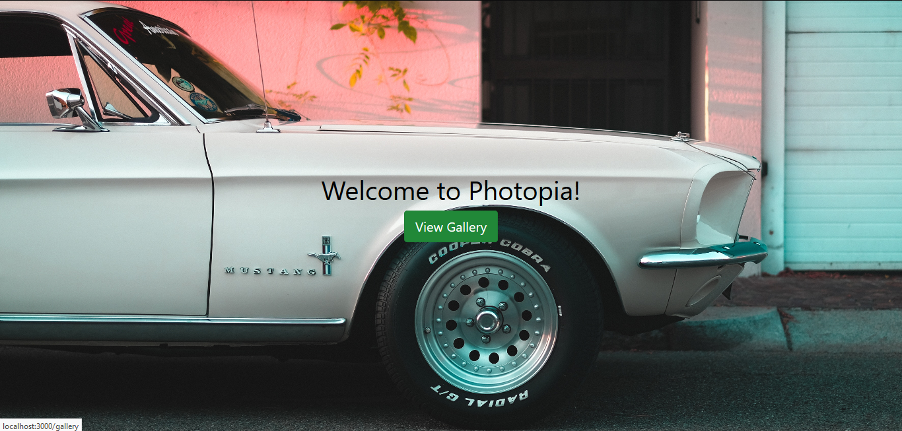
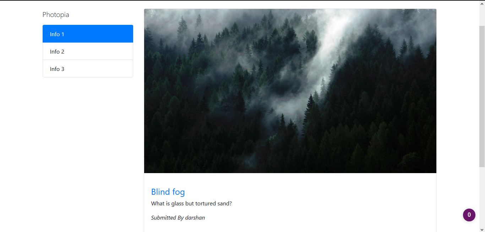

# Photopia

Photopia is a Web App built in the **MEN** Stack (Mongo, Express and Node) built by [@darshancc23](https://github.com/darshancc23).
It involves building a simple media app around the upload of Images. Users can create an account using very little information
and are then able to upload new photos that they wish to share or comment on the ones already uploaded by others.

## Demo
[Click here for a Live Demo :rocket:](http://nodejs-photopia.herokuapp.com/)

## Screenshots





## Tech Stack
The following technologies have been used in the making of the Application

- [NodeJS](https://nodejs.org)
- [Express JS](https://expressjs.com)
- [Passport JS](https://passportjs.org)
- [MongoDB](https://www.mongodb.com/)
- [Mongoose Library](https://mongoosejs.com/)
- [EJS](https://ejs.co)
- [Body Parser](https://www.npmjs.com/package/body-parser)
- [Flash Messaging](https://github.com/jaredhanson/connect-flash)

## Setup Instructions
These instructions will get you a copy of the project up and running on your local machine for development and testing purposes. 

- Clone the repository
- Install the packages
```
npm install
```
- Run the application
```
npm start
```

Now simply visit `localhost:3000` on your browser.
